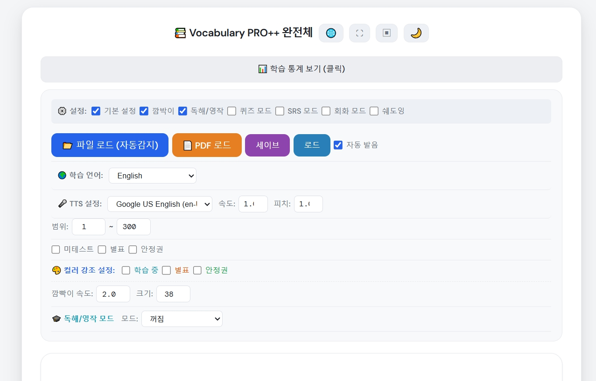
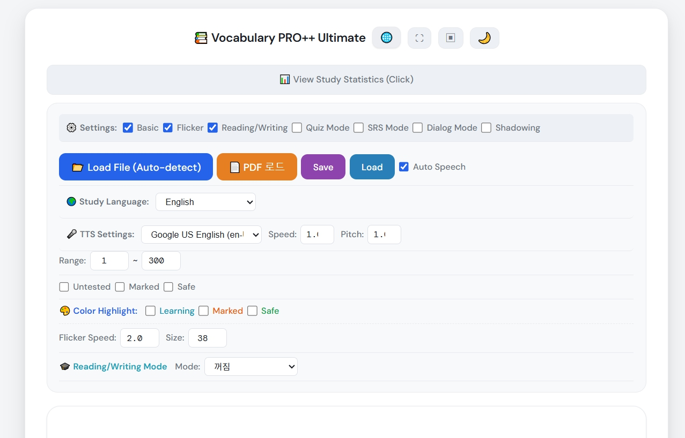
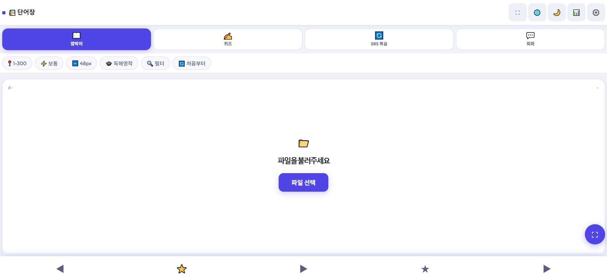
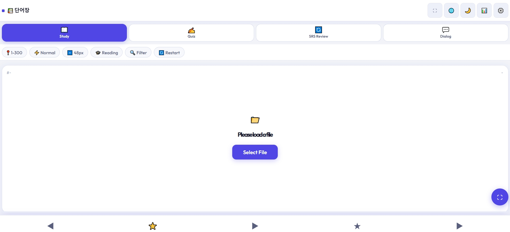
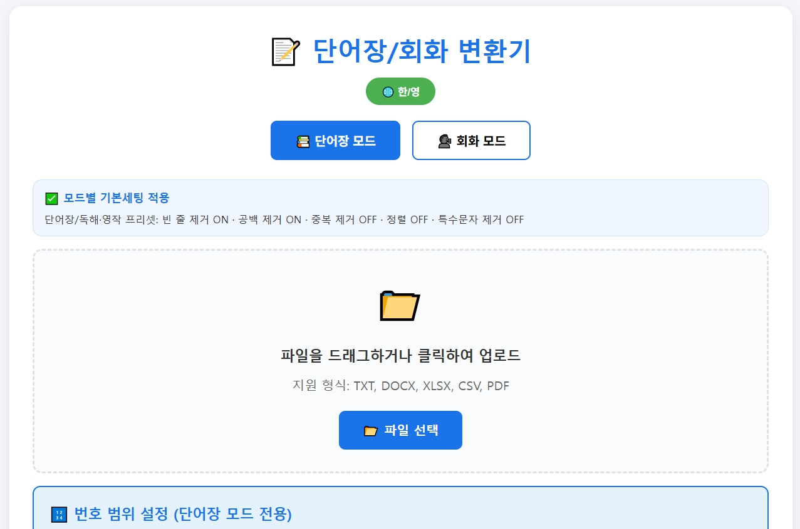
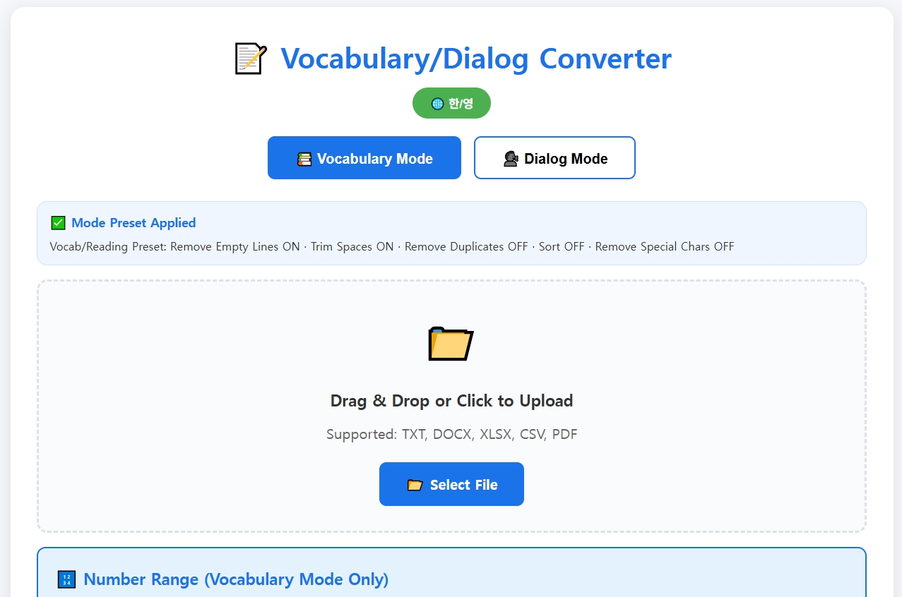

# 📚 Vocabulary PRO++

<p align="center">
  <b>Memorized 2,000 words in 18 days — 40 min/day, no carryover.</b><br/>
  A free, offline-ready vocab &amp; conversation study tool for any language.
</p>

<p align="center">
  <a href="https://lightborn77-gif.github.io/Mobile-word-sentence/">
    
  </a>
  &nbsp;
  <a href="https://lightborn77-gif.github.io/pc-word-sentence/">
    
  </a>
</p>

<p align="center">
  
  
</p>

---

> This tool was originally built for personal English study — reading original texts and preparing for exams.  
> The method behind it led to **memorizing 2,000 words at 99% retention in 18 days, 40 min/day with zero carryover**.  
> As it evolved, it became clear the structure works for any foreign language,  
> so it's now shared for learners of Japanese, Chinese, Spanish, and beyond.

---

## 🌐 지원 언어 / Supported Study Languages

**11개 학습 언어 지원 · Supports 11 Study Languages**

| | 언어 / Language | TTS 코드 |
|---|---|---|
| 🇺🇸 | English | en-US |
| 🇯🇵 | 日本語 | ja-JP |
| 🇨🇳 | 中文 | zh-CN |
| 🇪🇸 | Español | es-ES |
| 🇩🇪 | Deutsch | de-DE |
| 🇫🇷 | Français | fr-FR |
| 🇮🇹 | Italiano | it-IT |
| 🇵🇹 | Português | pt-PT |
| 🇷🇺 | Русский | ru-RU |
| 🇸🇦 | العربية | ar-SA |
| 🇰🇷 | 한국어 | ko-KR |

> UI 자체도 **한국어 ↔ 영어** 전환 가능 · UI language toggles between **Korean ↔ English**

---

## 📁 구성 파일 / File Structure

| 파일 / File | 설명 / Description |
|---|---|
| `ws_pc_layout_960/` | **PC 버전** — `ws_pc_output/index.html` 실행 · **PC Version** |
| `ws_mobile_redesign_i18n_fixed/` | **모바일 버전** — `ws_output/index.html` 실행 · **Mobile Version** |
| `logicmaker_plusPDF.html` | **로직메이커(변환기)** — 단어장·회화 파일을 앱 형식으로 변환 · **Converter** |
| `FORMAT_GUIDE.txt` | 텍스트 파일 작성 규칙 전체 가이드 · Full text format reference |
| `LICENSE` | 비상업적 자유 사용 라이선스 · Non-commercial free use license |

---

## 📸 스크린샷 / Screenshots

### 모바일 버전 · Mobile Version
<p>
  
  
</p>

### 로직메이커(변환기) · Logic Maker (Converter)
<p>
  
  
</p>

---

## 🚀 실행 방법 / How to Run

### PC 버전 · PC Version
1. `ws_pc_layout_960/ws_pc_output/index.html`을 Chrome / Edge로 열기  
   Open `ws_pc_layout_960/ws_pc_output/index.html` in Chrome or Edge
2. **파일 로드 (자동감지)** 버튼으로 단어장 TXT 또는 PDF 업로드  
   Click **Load File (Auto-detect)** to upload a vocabulary TXT or PDF
3. 깜박이 / 퀴즈 / SRS / 회화 / 쉐도잉 모드 선택 후 학습 시작  
   Select a study mode: Flicker / Quiz / SRS / Dialog / Shadowing

### 모바일 버전 · Mobile Version
1. `ws_mobile_redesign_i18n_fixed/ws_output/index.html`을 스마트폰 브라우저로 열기  
   Open `index.html` on a smartphone browser (Chrome / Safari)
2. 상단 탭 선택: 깜박이(Study) / 퀴즈(Quiz) / SRS 복습 / 회화(Dialog)  
   Select a tab: Study / Quiz / SRS Review / Dialog
3. **파일 선택** 버튼으로 단어장 업로드  
   Tap **Select File** to load your vocabulary file

### 로직메이커 · Logic Maker (Converter)
1. `logicmaker_plusPDF.html`을 브라우저로 열기 · Open in a browser
2. **단어장 모드** 또는 **회화 모드** 선택 · Select Vocabulary or Dialog Mode
3. TXT / DOCX / XLSX / CSV / PDF 파일 업로드 · Upload your file
4. 변환 옵션 설정 → **변환하기** 클릭 → 다운로드  
   Set options → Click **Convert** → Download

---

## 🔄 자료 준비 → 학습까지 전체 플로우 / Full Workflow: Prep to Study

```
┌───────────────────────────────────────────────────────────────────┐
│  📥  원본 자료 준비 / Prepare Source Material                       │
│                                                                   │
│  교재 PDF / 엑셀 / DOCX / CSV / 직접 작성 TXT                      │
│  Textbook PDF / Excel / DOCX / CSV / Handwritten TXT              │
└──────────────────────────────┬────────────────────────────────────┘
                               │
                               ▼
┌───────────────────────────────────────────────────────────────────┐
│  🤖  AI로 스크립트 다듬기 (선택) / Refine with AI (Optional)         │
│                                                                   │
│  ChatGPT / Claude 등에 프롬프트 / Prompt:                          │
│                                                                   │
│  [단어장] "아래 단어 목록을 다음 형식으로 변환해줘:                    │
│           번호. 영어단어 / 번호. 한국어뜻  (2줄씩 쌍으로)"            │
│  [Vocab]  "Convert this list to:                                  │
│           num. English / num. Korean  (2-line pairs)"             │
│                                                                   │
│  [회화]   "A: [영어 대사] / [한국어 번역] 형식으로 정리해줘"           │
│  [Dialog] "Format as: A: [English] / [Korean translation]"        │
└──────────────────────────────┬────────────────────────────────────┘
                               │
                               ▼
┌───────────────────────────────────────────────────────────────────┐
│  🔧  로직메이커로 파일 정제 / Refine with Logic Maker                │
│                                                                   │
│  logicmaker_plusPDF.html 열기 → 파일 업로드                         │
│  Open logicmaker_plusPDF.html → Upload file                       │
│                                                                   │
│  단어장 모드 프리셋 / Vocabulary preset:                            │
│    ✅ 빈 줄 제거 / Remove empty lines                              │
│    ✅ 공백 제거 / Trim spaces                                      │
│    ☑  중복 제거 / Remove duplicates  (선택 / optional)             │
│    ☑  번호 범위 지정 / Set number range  (선택 / optional)          │
│                                                                   │
│  회화 모드 프리셋 / Dialog preset:                                  │
│    ✅ 공백 제거 / Trim spaces                                      │
│    🔒 중복·정렬 자동 잠금 / Duplicate & Sort auto-locked OFF        │
│                                                                   │
│  → 미리보기 확인 → TXT 다운로드                                     │
│  → Preview → Download TXT                                        │
└──────────────────────────────┬────────────────────────────────────┘
                               │
                               ▼
┌───────────────────────────────────────────────────────────────────┐
│  📂  앱에 파일 로드 / Load File into App                            │
│                                                                   │
│  [파일 로드 (자동감지)] / [PDF 로드] 버튼 클릭                        │
│  Click "Load File (Auto-detect)" or "PDF Load"                    │
│                                                                   │
│  파일 형식 자동 감지 / Auto-Detection Logic:                        │
│    줄 앞 숫자 패턴 (^\\d+)  →  단어장 모드 / Vocabulary mode         │
│    A: / B: 패턴            →  회화 모드   / Dialog mode            │
└──────────────────────────────┬────────────────────────────────────┘
                               │
                               ▼
┌───────────────────────────────────────────────────────────────────┐
│  🎯  학습 모드 선택 / Choose Study Mode                             │
│                                                                   │
│   ① 깜박이 (Flicker/Study)    ② 퀴즈 (Quiz)                        │
│   ③ SRS 복습 (SRS Review)    ④ 회화 (Dialog)                      │
│   ⑤ 쉐도잉 (Shadowing) — PC 전용 / PC only                        │
└──────────────────────────────┬────────────────────────────────────┘
                               │
                               ▼
┌───────────────────────────────────────────────────────────────────┐
│  💾  진행 자동 저장 / Auto-Save Progress                            │
│                                                                   │
│  브라우저 localStorage에 파일명 키로 저장 (서버 불필요)                │
│  Saved to localStorage by filename key (no server needed)         │
│  같은 파일 재로드 시 이전 데이터 자동 복원                             │
│  Reload same filename → previous progress auto-restored           │
└───────────────────────────────────────────────────────────────────┘
```

---

## 🎯 주요 기능 / Features

### 1. 깜박이 모드 · Flicker / Study Mode
- 단어 표시 → 클릭/스페이스바로 뜻 확인 · Show word → reveal meaning on click/spacebar
- **TTS 자동 발음**: 선택한 학습 언어로 단어 자동 낭독 · Auto TTS in selected study language
- 음성 선택·속도·피치 조절 · Voice selection, speed & pitch control
- 독해/영작 모드: 뜻 → 단어 방향 반전 · Reading/Writing mode: flip direction
- 미암기 / 별표 / 안정권 필터 · Untested / Marked / Safe word filter
- 컬러 강조 표시: 학습 중 / 별표 / 안정권 색상 구분 · Color highlight by status

### 2. 퀴즈 모드 · Quiz Mode
- 단어를 보고 뜻을 직접 입력하는 주관식 · Open-answer quiz: type the meaning from memory
- 퀴즈 풀 구성 옵션 · Pool options:
  - 미테스트 우선 · Untested words first
  - 별표(오답 누적) 우선 · Marked (wrong history) first
  - 안정권 단어 포함 · Include Safe words
  - **부활 기능**: 최근 N일 내 틀린 단어 자동 추가 · **Revive**: auto-add words wrong within N days
- 채점 즉시 피드백, 오답 시 정답 표시 · Instant grading with correct answer revealed on wrong

### 3. SRS 복습 모드 · SRS Review Mode
**망각 곡선 기반 간격 반복 · Spaced Repetition based on the forgetting curve**

| 항목 / Item | 내용 / Detail |
|---|---|
| 정답 시 / Correct | `interval = round(interval × easeFactor)` — 기본 2.5 · default 2.5 |
| 오답 시 / Wrong | `interval = round(interval × lapseRate)` — 기본 0 = 1일 리셋 · default: reset to 1 |
| 안정권 조건 / Safe | 연속 정답 ≥ 5 AND 누적 정답 ≥ 10 · Streak ≥ 5 AND Total ≥ 10 |
| 복습 대상 / Due | `lastSeen + interval ≤ today` |
| Hard Only | 별표 ≥ 3 이고 isSafe = false · Words with w ≥ 3 and not safe |

### 4. 회화 모드 · Dialog Mode
- A/B 역할 대화문 학습 · A/B role-based conversation study
- 화자 전환(역할 바꾸기) · Speaker toggle (swap your role)
- TTS 자동 낭독 · Auto TTS playback per line

### 5. 쉐도잉 모드 · Shadowing Mode *(PC 버전 전용 · PC only)*
- TTS 재생과 함께 따라 말하기 · Shadow-speak along with TTS playback
- 자동 / 수동 진행 전환 · Auto / Manual advance
- 구간 반복 재생 · Segment loop repeat

### 6. 학습 통계 · Study Statistics
- 전체 / 암기 완료 / 별표 / 안정권 수 시각화 · Total / Memorized / Marked / Safe counts
- 날짜별 오답 기록 추적 · Wrong date history per word
- 퀴즈 정답률 통계 · Quiz accuracy stats

### 7. 다크 모드 / 전체화면 · Dark Mode / Fullscreen
- 라이트 ↔ 다크 테마 토글 · Light ↔ Dark theme toggle
- 전체화면 몰입 모드 · Immersive fullscreen
- 모바일: 스와이프 제스처 네비게이션 · Mobile: swipe gesture navigation

---

## 📝 입력 파일 형식 / Input File Formats

### 단어장 TXT · Vocabulary TXT

**방식 A · Method A — 2줄 쌍 (권장 · Recommended)**
```
1. apple
1. 사과
2. banana
2. 바나나
```

**방식 B · Method B — 일본어/중국어 등 비알파벳 외국어**
```
1. 食べる
1. 먹다
2. 走る
2. 달리다
```

**파싱 규칙 · Parsing Rules**
- `^\\d+` + 구분자(`. - 공백`) 이후 텍스트 추출 · Extract text after number + delimiter
- 알파벳 only → `word` 필드 / 한글·비알파벳 → `meaning` 필드
- 괄호 `()` 내 텍스트, 이모지(✅🟢❌) 자동 제거 · Auto-strip parentheses & emoji
- 같은 번호에 여러 뜻 → 쉼표 병합 · Multiple meanings on same number → comma-joined

### 회화 TXT · Dialog TXT
```
A: How are you?
잘 지내고 있어요?
B: I'm doing great, thanks!
정말 잘 지내고 있어요, 감사합니다!
```
- `A:` / `B:` 접두사 → 외국어 대사 · `A:/B:` prefix → foreign language line
- 바로 다음 줄 → 번역 (없어도 됨) · Next line → translation (optional)

### PDF 형식 · PDF Format
표(Table) 구조를 자동 파싱합니다 · Auto-parses table structure:
```
| 번호 | 단어       | 뜻        |
|  1  | apple      | 사과       |
|  2  | beautiful  | 아름다운    |
```
> 이미지 PDF(스캔본)는 지원하지 않습니다 · Scanned/image PDFs are not supported

---

## 💾 데이터 저장 / Data Storage

서버 없이 **브라우저 localStorage**에 자동 저장됩니다.  
Auto-saved to **browser localStorage** — no server required.

```
저장 키 / Key:   mem_{파일명 / filename}
저장 필드 / Fields:
  n              번호 / Word number
  m              암기 완료 여부 / Memorized flag
  w              별표 횟수(오답 누적) / Wrong count
  lastSeen       마지막 학습일 / Last studied (YYYY-MM-DD)
  interval       다음 복습까지 일수 / Days until next review
  wrongDates     오답 발생 날짜 배열 / Wrong date history array
  quizCount      퀴즈 출제 횟수 / Total quiz appearances
  correctStreak  연속 정답 횟수 / Current correct streak
  totalCorrect   누적 총 정답 횟수 / Total correct count
  isSafe         안정권 여부 / Mastered (safe) flag
```

> 같은 파일명으로 재로드 시 이전 학습 데이터 자동 복원  
> Reload same filename → previous progress auto-restored

---

## ⚙️ 시스템 요구사항 / Requirements

| | |
|---|---|
| **브라우저 / Browser** | Chrome 90+, Edge 90+, Safari 15+, Firefox 88+ — **다국어 TTS 지원은 Edge 권장 · Edge recommended for multilingual TTS** |
| **인터넷 / Internet** | PDF 로드 시 PDF.js CDN 최초 1회 · Required once for PDF loading |
| **서버 / Server** | 불필요 · Not required — runs fully local |
| **권장 브라우저 / Recommended** | Chrome·Edge 모두 정상 실행되나, **11개국 다국어 TTS는 Edge 실행을 권장합니다** · Both Chrome & Edge work, but **Edge is recommended for full multilingual TTS support** |
| **TTS** | 브라우저 내장 Web Speech API · Browser built-in Web Speech API |

---

## 📄 라이선스 / License

[LICENSE](LICENSE) 참조 · See LICENSE file

**비상업적 목적이라면 개인 사용·수정·재배포 모두 자유롭게 허용합니다.**  
**Free to use, modify, and redistribute for any non-commercial purpose.**  
CC BY-NC 4.0

---

## 🙏 피드백 / Feedback

이슈 또는 PR로 의견을 남겨주세요.  
더 많은 언어 학습자들에게 도움이 되도록 함께 발전시켜 나가고 싶습니다.

Issues and PRs are welcome.  
Let's make this useful for learners of every language together.
